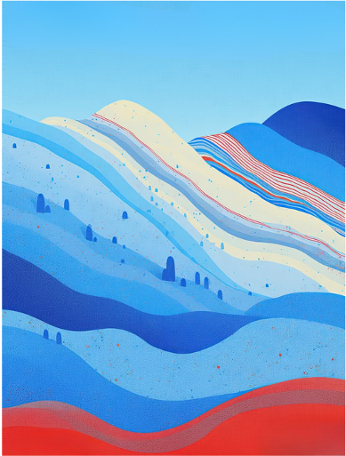

# 新南学联网站品牌规范

## 使用范围

本文件用于指导 Codex 设计和实现新南学联网站。品牌手册和正式品牌素材优先于本文件；信息不足时不得自行重绘 Logo、编造品牌元素或扩展新的视觉规则。

网站应保持正式、温暖、可信和简洁，体现华人学生社区属性。避免堆砌文字、过度装饰、复杂动画和不必要的视觉元素。

## 品牌名称

- 中文正式名称：新南威尔士大学中国学生学者联谊会。
- 中文常用简称：新南学联。
- 英文正式名称：University of New South Wales Chinese Student Association。
- 英文简称：UNSWCSA。
- 在空间充足、需要正式介绍的场景使用中英文正式名称。
- 在导航、按钮、移动端、小尺寸组件和重复出现的场景，可以使用“新南学联”“UNSWCSA”或“UNSW”。
- UNSW 在合适场景可以作为 University of New South Wales 的简写。
- 不自行创造其他组织名称、英文译名或缩写。

## 品牌颜色

| Token | 色值 | 用途 |
| --- | --- | --- |
| `brand-navy` | `#03207B` | 主品牌色、导航、标题、深色背景和主要按钮 |
| `brand-red` | `#AE1F25` | 重点操作、重要标记和少量视觉强调 |
| `brand-blue` | `#2559BD` | 链接、次级按钮和信息强调 |
| `brand-sky` | `#7BC4EC` | 浅色背景、装饰和标签底色 |

### 颜色使用规则

- 页面以白色和低饱和中性色作为主要背景。
- `brand-navy` 是网站的主要结构色。
- `brand-red` 只用于重点操作和少量强调，不与主蓝色争夺大面积视觉焦点。
- `brand-blue` 用于链接、次级操作和信息强调。
- `brand-sky` 只用于浅色背景和装饰，不直接用于白底小字号正文。
- 不在同一模块中同时大面积使用全部品牌色。
- 不随意增加新的高饱和主题色。
- 成功、警告和错误状态使用清楚的语义色，不强行用品牌色代替。
- 所有文字与背景组合必须满足可读性和对比度要求。

### 网站颜色语义

- 页面背景：白色或接近白色的中性色。
- 主要正文：深灰或黑色。
- 主标题：黑色或 `#03207B`。
- 主要按钮：`#03207B` 背景配白色文字。
- 重点按钮：`#AE1F25` 背景配白色文字。
- 文本链接：`#2559BD`，并通过下划线或悬停状态提供额外识别。
- 浅色信息区域：使用由 `#7BC4EC` 派生的低饱和浅色背景，搭配 `#03207B` 或深色文字。
- 边框：使用低对比度中性灰，不默认使用品牌色描边。

## 品牌字体

- 品牌手册指定的中文展示字体：可画和刘局方明刻本-简。
- 该字体只用于 Logo 锁定组合、重要品牌标题或少量装饰性标题。
- 不用于长段正文、按钮、小字号文字或移动端密集内容。
- 未确认合法的网页使用授权并取得字体文件前，不得将该字体作为 Web Font 打包。
- 正文使用清晰、可访问、跨平台的中文无衬线字体。
- 英文正文使用与中文正文协调的无衬线字体。

建议的正文回退字体：

```css
font-family: "Noto Sans SC", "PingFang SC", "Microsoft YaHei", sans-serif;
```

## Logo 使用

- 只能使用品牌手册提供的正式 Logo 文件。
- 不通过文字、CSS 或生成式图像重新制作 Logo。
- 不改变 Logo 的颜色、比例或组成关系。
- 不拉伸、压缩、旋转、裁切或增加阴影。
- 不单独移动 Logo 内部的图形和文字。
- 不将 Logo 放在复杂、低对比度的照片区域。
- 使用 `frontend/public/brand/logos/` 中的正式资产，不使用截图或临时文件替代。
- 页面 Header 优先使用 `/brand/logos/unswcsa-horizontal.png`。
- 小尺寸品牌标识使用 `/brand/logos/unswcsa-primary.png`；在未提供正式 favicon 前，不自行从该图片裁切或生成 favicon。
- Arc 标识使用 `/brand/logos/Arc-green.png` 或 `/brand/logos/Arc.jpg`，具体版本按背景和版面选择。
- 与 UNSW Logo 联合展示时，必须使用品牌手册批准的组合、比例和间距。

以下项目需要以完整品牌手册或正式资产为准，不得自行推断：

- Logo 安全留白。
- 最小显示尺寸。
- 深色背景版本。
- 黑白版本。
- 横版与竖版的适用场景。
- 是否允许只使用 UNSWCSA 独立图标。
- UNSW Logo 的授权和联合展示规则。

## 品牌背景纹样

品牌手册提供了一张由蓝色、浅蓝色、米白色和红色波浪组成的竖版背景，通常用于 PPT、证书等正式材料。

正式网站资产：

- 横版背景：`/brand/patterns/background.png`
- 竖版背景：`/brand/patterns/background-vertical.png`



### 背景使用规则

- 该图案是品牌背景和装饰素材，不是网站默认的全页背景。
- 可用于 Hero 边缘、页面分隔、品牌活动封面边框、页脚装饰或少量强调区域。
- 正文区域应保持干净，优先使用白色或浅色背景。
- 不将长篇正文直接覆盖在纹样复杂的位置。
- 如果文字必须叠加在背景上，应使用具有足够不透明度的纯色承载区域并保证对比度。
- 不拉伸图案；裁切时保持波浪方向和视觉重心自然。
- 同一页面最多设置一个主要纹样区域，避免重复铺满。
- 移动端应减少装饰面积，不能挤压正文和操作按钮。
- 横向或大面积场景优先使用高清的 `background.png`；窄幅或竖向装饰可以使用 `background-vertical.png`，不得超出其清晰度范围放大。
- 不使用生成式工具模仿或重新绘制该品牌纹样，除非用户明确授权创建新变体。

## 网站视觉方向

- 使用白色和充足留白作为页面基础。
- 以深蓝建立页面结构，以红色进行少量强调，以蓝色和浅蓝辅助信息层级。
- 优先使用真实社团活动照片和正式品牌资产。
- 每个页面只设置一个主要视觉焦点。
- 避免霓虹科技风、过度渐变、粒子效果、大面积发光和复杂滚动动画。
- 动画保持轻量，只用于进入、悬停和状态变化。
- 不为了填满页面加入没有信息价值的图形和文案。
- 品牌活动可以使用统一品牌色，或从批准的预设品牌色中选择主题色；不允许输入任意颜色。

## 图片规范

- 优先使用新南学联自己的活动照片，不使用与内容无关的图库图片。
- 首页和品牌活动优先展示有人物、现场氛围或学联标识的照片。
- 活动和品牌活动封面统一使用 `16:9`。
- 团队成员照片统一使用 `1:1` 或 `4:5`，一个页面内必须保持一致。
- 荣誉相关图片建议使用 `4:3`。
- 合作伙伴 Logo 放入统一尺寸的容器并保持原比例。
- 图片不得拉伸变形。
- 图片上传时应检查尺寸并自动压缩。
- 新上传未发布图片默认受保护，登录后预览，发布时再开放对应版本；已公开的正式品牌素材无需重新私有化。图片权限规则见 `admin-publishing-architecture.md`。
- 有信息价值的图片必须提供简短准确的替代文字。
- 同一模块不混用明显不同的滤镜、色温和处理风格。

## 排版和内容密度

- 页面标题简短明确。
- 首页简介控制在一至两段。
- 长内容优先拆成短段或 bullet point。
- 荣誉与影响力使用 bullet point，不建立复杂详情页。
- 每个内容区块只表达一个主题。
- 不为了填满页面增加空泛宣传文案。
- 卡片只展示用户进行判断或操作所需要的信息。
- 桌面端正文保持舒适行宽，不横跨整个屏幕。
- 中英文同时出现时保持清楚层级，英文不应压过中文主标题。
- 不使用过小字号容纳过多内容。

## 社交媒体

- 官方社交入口包括 Instagram、小红书、微信公众号、抖音和 Eventbrite。
- 社交平台名称、账号和链接由内容后台的网站设置管理。
- 网页优先提供可点击链接。
- 二维码只作为补充，不作为唯一访问方式。
- 不从截图中提取、复制或重新生成二维码。
- 二维码必须使用负责人提供的正式文件，并定期确认仍然有效。

## 可访问性

- 正文和重要操作必须满足 WCAG AA 对比度要求。
- `#7BC4EC` 不用于白底小字号正文。
- 按钮和状态不能只通过颜色表达含义。
- 键盘应能访问所有导航、按钮和筛选控件。
- 交互元素必须有清晰可见的焦点状态。
- 不把重要文字只放在图片中。
- 移动端不能通过缩小字体强行容纳内容。
- 尊重用户的减少动态效果设置。

## 时效性内容

以下内容属于内容后台数据，不是永久品牌规则：

- 每年举办的活动数量。
- 团队和成员规模。
- 奖项数量。
- 某一年获得的具体奖项。
- 当前社交账号和二维码。
- 活动参与人数和合作规模。

使用这些数据前必须确认年份和来源，不得根据旧截图或示例自行沿用。

## 资产管理

正式品牌资产位于：

```text
frontend/public/brand/
├── logos/
│   ├── Arc-green.png
│   ├── Arc.jpg
│   ├── unswcsa-horizontal.png
│   └── unswcsa-primary.png
├── patterns/
│   ├── background.png
│   └── background-vertical.png
└── social/
    ├── Insta.png
    ├── RedNot.png
    ├── Tiktok.png
    └── WeChat.png
```

- Codex 实现网站时应优先复用以上资产，并使用 `/brand/...` 形式的公开 URL。
- `social/` 中的文件是社交平台图标，不应当作二维码使用。
- 品牌规范 Markdown 只记录规则，正式 Logo、纹样、社交图标和二维码必须保存为独立资源文件。
- 不使用截图中的 Logo 或二维码作为生产资源。
- 不把临时下载路径作为网站运行时依赖。
- `.DS_Store` 不是品牌资产，不得在页面中引用，并应由 Git 忽略。
