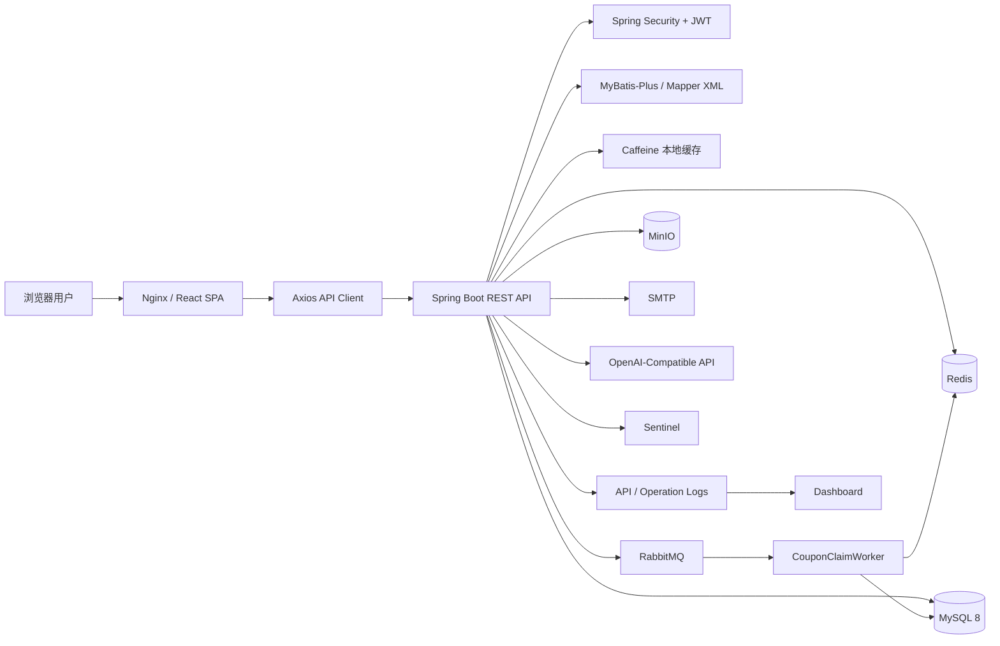
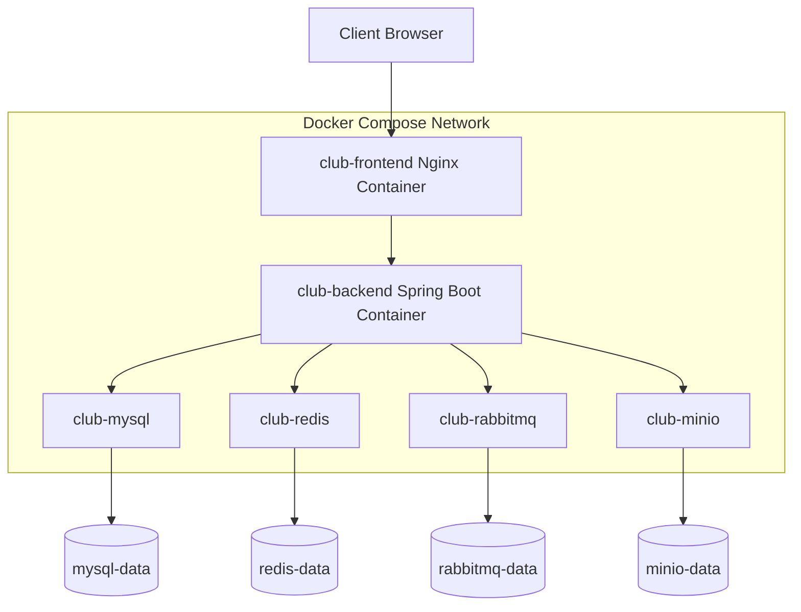
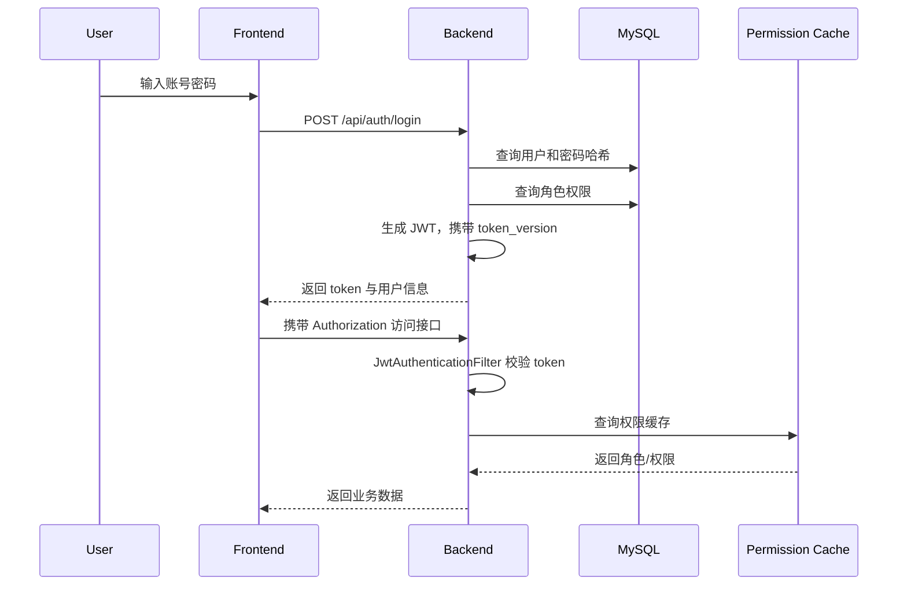
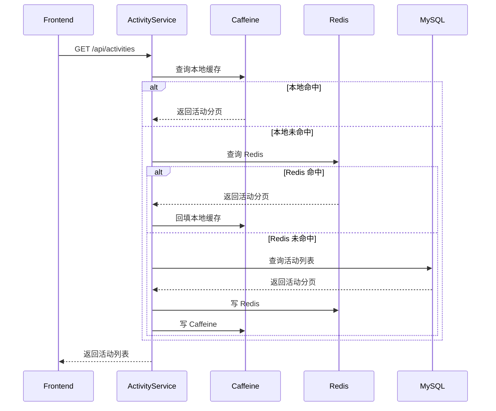
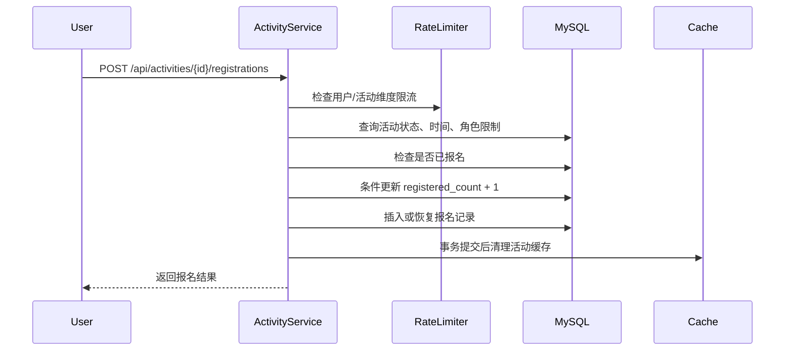
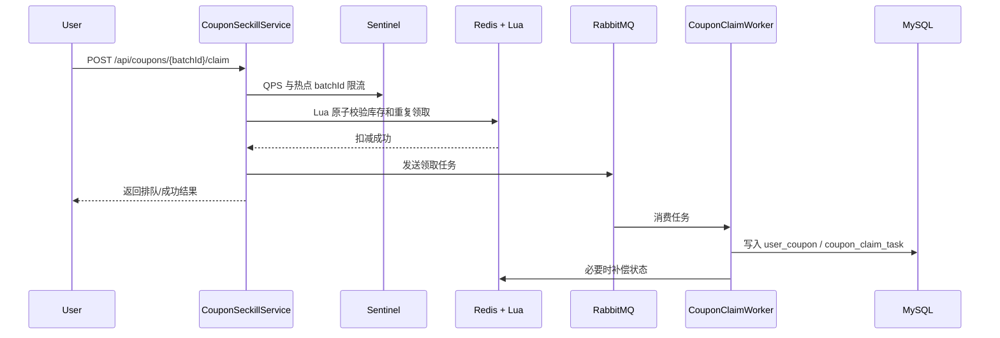
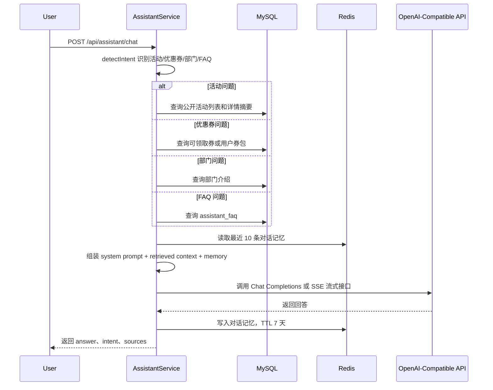
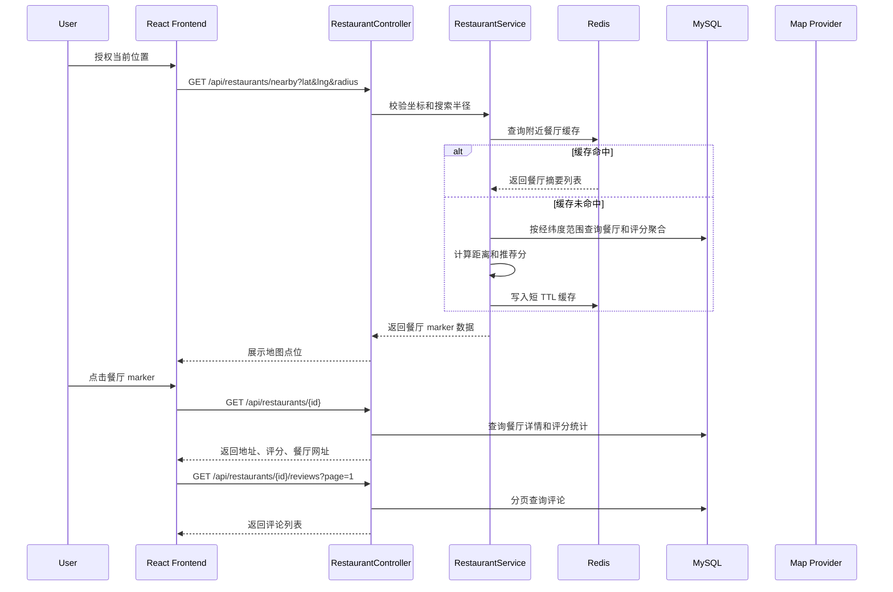

# Club System Plus 项目架构、运行指南与面试准备

> 文档范围（2026-09-24）：本文保留旧完整平台的说明、规划或历史记录，不作为新版需求及实施进度依据。新版以 [context 文档入口](../context/README.md) 为准，六个页面方案已确认；第二阶段需求冻结已完成；新版采用自建 /admin、GitHub 内容文件与自动构建发布，Eventbrite 独立提供活动，草稿私有保存、预览和未发布新图片受保护，下一步进行数据源 PoC；最新进度见 context/project-status.md。

本文用于快速理解 Club System Plus 的当前项目内容、运行方式、系统架构、核心业务链路、性能优化点和简历/面试表达。文档以当前仓库实现为准，避免把后续规划写成已经完成的能力。

## 1. 项目一句话介绍

Club System Plus 是一个面向大学社团的全栈运营系统，覆盖社团官网展示、用户注册登录、RBAC 权限、活动发布与报名、优惠券领取/秒杀、部门与成员管理、后台数据面板、文件上传、轻量业务 RAG 助手和接口访问日志统计。

简历概括可以写成：

> 基于 Spring Boot、React、MySQL、Redis、RabbitMQ、MinIO 构建的社团活动运营平台，实现 JWT 认证、RBAC 权限、活动报名、优惠券秒杀、二级缓存、接口限流、异步削峰、对象存储、后台数据统计和轻量业务 RAG 助手，并通过 JMeter 压测验证热点接口优化效果。

## 2. 当前技术栈

### 后端

| 模块 | 技术 | 项目中的作用 |
| --- | --- | --- |
| Web 框架 | Spring Boot 4 / Spring MVC | 提供 REST API、参数绑定、统一异常处理 |
| 安全认证 | Spring Security + JWT | 登录态认证、接口鉴权、无状态 API |
| ORM | MyBatis-Plus + Mapper XML | 基础 CRUD 与复杂 SQL 查询 |
| 数据库 | MySQL 8.4 | 用户、权限、活动、优惠券、日志等核心数据 |
| 数据迁移 | Flyway | 管理初始化建表、种子数据和后续表结构演进 |
| 缓存 | Caffeine + Redis | 用户权限缓存、活动列表/详情热点读缓存 |
| 限流 | Redis 业务限流 + Sentinel | 登录、验证码、报名、抢券等接口保护 |
| 消息队列 | RabbitMQ | 优惠券抢券成功后的异步落库削峰 |
| 文件存储 | MinIO | 活动封面、回顾图片等对象存储 |
| 邮件服务 | Spring Mail / SMTP | 密码重置验证码发送 |
| API 文档 | Springdoc OpenAPI | dev/docker 环境 Swagger 文档 |
| AI/RAG 助手 | OpenAI-Compatible API + 业务数据检索 + FAQ | 通过意图识别检索活动、优惠券、部门、FAQ 等系统数据，拼接上下文后调用模型回答 |
| 日志统计 | Filter + Scheduler | API 访问日志、操作日志和后台统计聚合 |

### 前端

| 模块 | 技术 | 项目中的作用 |
| --- | --- | --- |
| 框架 | React 19 | 构建单页应用 |
| 语言 | TypeScript | API 类型约束，降低运行时错误 |
| 构建 | Vite 7 | 本地开发和生产构建 |
| 路由 | React Router 7 | 官网、登录、活动、后台页面路由 |
| HTTP | Axios | 统一请求、Token 携带、错误处理 |
| 样式 | CSS | 官网展示、后台管理、响应式布局 |
| 部署 | Nginx | 静态资源服务和 `/api` 反向代理 |

### 基础设施

| 服务 | 当前配置 |
| --- | --- |
| Docker Compose | 编排 MySQL、Redis、RabbitMQ、MinIO、backend、frontend |
| MySQL | `mysql:8.4`，数据卷 `mysql-data` |
| Redis | `redis:7.4-alpine`，启用 AOF 和密码 |
| RabbitMQ | `rabbitmq:4-management`，用于异步抢券任务 |
| MinIO | `minio/minio`，用于图片对象存储 |
| Nginx | 前端容器内提供静态资源和 API 反向代理 |

## 3. 当前工程结构

```text
Club-system-plus/
  backend/
    Dockerfile
    pom.xml
    src/main/java/com/backend/
      common/auth/                  JWT、认证过滤器、用户 Principal
      pojo/dto|entity|vo/           DTO、实体、返回对象
      sever/
        BackendApplication.java
        config/                     安全、缓存、限流、MinIO、RabbitMQ、AI、日志配置
        controller/                 Auth、User、Activity、Coupon、Organization、RBAC、Dashboard、File、Assistant
        mapper/                     MyBatis Mapper
        service/                    业务接口
        service/impl/               业务实现、MQ producer/worker、缓存逻辑
    src/main/resources/
      application.yml
      application-dev.yml
      application-docker.yml
      application-prod.yml
      db/migration/                 Flyway 迁移脚本
      mapper/                       Mapper XML

  frontend/
    Dockerfile
    nginx.conf
    package.json
    src/
      api/                          Axios 封装和业务 API 模块
      components/                   AI 助手、加载组件
      router/                       React Router
      views/                        官网、活动、优惠券、后台、个人中心页面
      styles/                       全局样式

  docs/
    project_architecture_interview_guide.md
    qps_test_records.md
    jmeter_api_test_plan.md

  scripts/
    generate_jmeter_tokens.ps1
    活动报名qps.jmx

  docker-compose.yml
  .env.example
  README.md
```

## 4. 运行指南

### 4.1 本地开发模式

本地开发适合前后端分别启动。后端默认使用 `dev` profile。

前置依赖：

- Java 17
- Node.js 22 或兼容版本
- MySQL 8
- Redis，可选但建议启动
- RabbitMQ，可选；dev 环境默认 `RABBITMQ_LISTENER_AUTO_STARTUP=false` 时消费者不自动启动
- MinIO，可选；如果测试文件上传需要启动

后端启动：

```powershell
cd backend
.\mvnw.cmd spring-boot:run
```

前端启动：

```powershell
cd frontend
npm install
npm run dev
```

默认访问地址：

```text
前端开发地址: http://localhost:5173
后端接口地址: http://localhost:8080/api
Swagger UI: http://localhost:8080/api/swagger-ui.html
OpenAPI JSON: http://localhost:8080/api/v3/api-docs
```

本地开发配置来源：

- `backend/src/main/resources/application.yml`：公共配置，默认 `server.servlet.context-path=/api`。
- `backend/src/main/resources/application-dev.yml`：本地 MySQL、Redis、RabbitMQ、MinIO、JWT、邮件配置。
- `frontend/vite.config.ts`：本地开发时将 `/api` 代理到后端。

### 4.2 Docker Compose 演示模式

Docker Compose 适合一键启动完整演示环境。

首次启动前复制环境变量文件：

```powershell
Copy-Item .env.example .env
```

至少修改 `.env` 中这些值，不建议继续使用 `change-me`：

```env
MYSQL_ROOT_PASSWORD=replace-with-root-password
MYSQL_USERNAME=club_app
MYSQL_PASSWORD=replace-with-app-password
REDIS_PASSWORD=replace-with-redis-password
RABBITMQ_USERNAME=club_mq
RABBITMQ_PASSWORD=replace-with-rabbitmq-password
MINIO_ROOT_USER=club_minio
MINIO_ROOT_PASSWORD=replace-with-minio-password
APP_JWT_SECRET=replace-with-at-least-32-chars-secret
APP_EMAIL_CODE_SECRET=replace-with-at-least-32-chars-secret
SPRING_PROFILES_ACTIVE=docker
HTTP_PORT=80
```

启动：

```powershell
docker compose up -d --build
```

查看日志：

```powershell
docker compose logs -f backend
docker compose logs -f frontend
```

停止：

```powershell
docker compose down
```

清空数据卷后重启，适合重新初始化数据库：

```powershell
docker compose down -v
docker compose up -d --build
```

Compose 默认访问：

```text
前端: http://localhost:${HTTP_PORT}
后端: 由前端 Nginx 反向代理到 /api
Swagger: http://localhost:${HTTP_PORT}/api/swagger-ui.html
```

### 4.3 生产模式

生产环境使用 `prod` profile。

关键差异：

- `application-prod.yml` 关闭 Swagger 和 OpenAPI。
- `app.security.trust-forward-headers=true`，适合放在可信反向代理后面。
- JWT、邮件验证码、MySQL、Redis、RabbitMQ、MinIO 密钥必须由环境变量提供。
- 推荐只暴露 HTTPS/Nginx/Caddy 入口，不直接暴露 MySQL、Redis、RabbitMQ、MinIO。

Docker Compose 生产环境建议：

```env
SPRING_PROFILES_ACTIVE=prod
HTTP_PORT=127.0.0.1:8081
APP_JWT_SECRET=replace-with-strong-secret-at-least-32-chars
APP_EMAIL_CODE_SECRET=replace-with-strong-email-code-secret
MAIL_HOST=smtp.example.com
MAIL_USERNAME=your-mail-user
MAIL_PASSWORD=your-mail-password
MAIL_FROM=your-mail-from
```

外层可以用 Caddy 或 Nginx 做 HTTPS：

```caddyfile
your-domain.com {
    reverse_proxy 127.0.0.1:8081
}
```

### 4.4 Flyway 数据库迁移

迁移目录：

```text
backend/src/main/resources/db/migration/
```

当前迁移文件：

```text
V1__init_schema.sql
V2__create_assistant_faq.sql
V3__add_activity_review_fields.sql
V4__seed_unsw_csa_activity_content.sql
```

规则：

- 后端启动时 Flyway 会自动创建 `flyway_schema_history` 并执行未执行过的迁移。
- 已经执行过的 `V1/V2/V3/V4` 不建议修改，后续改表应该新增 `V5__xxx.sql`。
- `baseline-on-migrate=true` 允许 Flyway 接管已有历史库。

### 4.5 默认账号和演示数据

默认初始化系统维护者：

```text
username: root
password: Root@123456
role: SYSTEM_MAINTAINER
```

首次运行后建议立刻修改密码。初始化脚本还会插入角色、权限、活动数据和一批优惠券演示数据。

### 4.6 常见运行问题

| 问题 | 处理方式 |
| --- | --- |
| 后端连不上 MySQL | 确认 MySQL 已启动，数据库名为 `club_system_plus`，账号密码与 `.env` 或 `application-dev.yml` 一致 |
| Flyway 报迁移冲突 | 不要直接修改已执行迁移；开发阶段可 `docker compose down -v` 清空卷重建 |
| 前端请求 404 | 确认后端 context-path 是 `/api`，前端请求路径也以 `/api` 开头 |
| Docker Compose 构建失败 | 先看 `docker compose logs -f backend` 和构建输出，确认 Dockerfile 阶段名、Maven 下载和 Node 构建是否正常 |
| Redis/RabbitMQ 密码错误 | 确认 `.env`、Compose 环境变量和应用配置中的密码一致 |
| 邮件验证码发不出 | dev 环境要配置真实 SMTP；prod 环境 `MAIL_HOST/MAIL_USERNAME/MAIL_PASSWORD/MAIL_FROM` 必须存在 |
| AI 助手不可用 | 默认 `AI_ENABLED=false`；需要启用时配置 `AI_API_KEY`、`AI_BASE_URL`、`AI_MODEL` |

## 5. 总体架构图



## 6. 部署架构图



部署说明：

- 前端容器对外暴露 HTTP 端口，后端只在 Docker 内部网络暴露 `8080`。
- 前端 Nginx 将 `/api/**` 反向代理到 `backend:8080/api/**`。
- MySQL、Redis、RabbitMQ、MinIO 默认只在 Compose 网络内使用，不应直接暴露公网。
- 生产环境外层建议接 HTTPS 反向代理。

## 7. 核心业务模块

| 模块 | 主要能力 |
| --- | --- |
| 认证模块 | 注册、登录、JWT 签发、当前用户查询、密码重置 |
| 用户模块 | 用户资料、头像、状态校验、Token 版本失效 |
| RBAC 模块 | 角色、权限、用户角色绑定、角色权限绑定 |
| 组织模块 | 部门、成员、部门负责人管理 |
| 活动模块 | 活动列表、详情、创建、审核、发布、取消、结束、报名 |
| 优惠券模块 | 券批次、库存、用户券、核销、秒杀抢券 |
| Dashboard 模块 | 用户数、活动数、报名数、接口访问趋势 |
| 文件模块 | 图片上传、类型校验、MinIO 存储、代理访问 |
| AI/RAG Assistant | 意图识别、活动/优惠券/部门/FAQ 检索、Prompt 组装、SSE 流式回答、使用限制、Redis 上下文记忆 |
| 日志模块 | API 访问日志、操作日志、统计聚合 |

## 8. 关键业务链路

### 8.1 登录与鉴权链路



面试表达重点：

- JWT 是无状态认证，适合前后端分离，后端不用维护 Session。
- 项目通过 `token_version` 解决修改密码或重置密码后旧 Token 仍可用的问题。
- 权限查询使用 Caffeine 缓存，减少高频接口反复查询角色权限表。
- 前端隐藏按钮只是体验优化，真正的安全边界在后端接口鉴权。

### 8.2 活动列表二级缓存链路



缓存设计：

- Caffeine 作为 JVM 内本地缓存，适合短 TTL 热点读，访问速度快。
- Redis 作为分布式缓存，适合多实例共享。
- 活动修改、发布、报名、取消报名后清理活动列表和详情缓存。
- 缓存失效放在事务提交后执行，避免事务未提交时并发请求重新缓存旧数据。

### 8.3 活动报名链路



关键点：

- 活动必须是 `PUBLISHED` 且未开始才能报名。
- 通过唯一索引 `activity_id + user_id` 防止同一用户重复报名。
- 通过 SQL 条件 `registered_count < capacity` 做容量保护，避免超卖。
- 报名成功或取消报名后清理活动缓存。

### 8.4 优惠券秒杀链路



面试表达重点：

- 秒杀场景不直接打 MySQL 扣库存，先在 Redis 中预热库存。
- Redis Lua 保证“查库存、查重复、扣库存”原子性。
- RabbitMQ 用于异步削峰，把瞬时高并发写请求转为可控消费。
- MySQL 唯一索引兜底防重复领取。
- Sentinel 保护热点券批次，避免单个 batchId 被打爆。


### 8.5 AI/RAG 助手链路

当前项目实现的是轻量业务 RAG，不是 PDF 向量库 RAG。它的核心是先从系统业务数据中检索可信上下文，再把上下文交给大模型回答，避免模型凭空编造活动、库存、地点和规则。



实现点：

- `AssistantServiceImpl` 先做意图识别，将问题路由到活动、优惠券、部门或 FAQ 检索逻辑。
- 活动、优惠券、部门问题直接查询业务服务，保证时间、地点、库存、报名人数等动态数据来自数据库。
- FAQ 问题查询 `assistant_faq` 表，适合回答加入社团、报名取消、优惠券使用、角色权限等规则类问题。
- Prompt 明确要求模型只能基于“已检索到的系统数据”回答，数据不足时说明没有查到。
- `AssistantMemoryServiceImpl` 使用 Redis 保存最近 10 条对话，TTL 为 7 天，用于连续追问。
- `OpenAiCompatibleChatClient` 支持普通回答和 SSE 流式回答，可替换 OpenAI-compatible 模型服务。

面试表达边界：

- 可以说这是“业务数据检索增强的轻量 RAG”或“FAQ + 业务数据 RAG”。
- 不要说已经实现 PDF 切块、embedding、向量数据库或相似度召回，因为当前代码没有这些模块。
- 如果面试官追问和传统 RAG 的区别，回答重点是：传统 RAG 多用于非结构化文档检索，本项目优先检索结构化业务数据，保证活动时间、库存和用户券包这类动态信息准确。

## 9. 数据库设计重点

| 业务 | 表 |
| --- | --- |
| 用户权限 | `app_user`、`role`、`permission`、`user_role`、`role_permission` |
| 组织结构 | `department`、`club_member`、`department_leader` |
| 活动 | `activity`、`activity_registration` |
| 优惠券 | `coupon_batch`、`user_coupon`、`coupon_redemption`、`coupon_claim_task` |
| 日志统计 | `api_access_log`、`operation_log`、`api_access_minute_stat`、`api_path_hour_stat`、`user_activity_day_stat` |
| AI/RAG 助手 | `assistant_faq`，并实时读取 `activity`、`coupon_batch`、`user_coupon`、`department` 等业务表作为上下文 |

设计亮点：

- 用户和社团成员分表，注册用户不一定是社团成员。
- RBAC 使用用户-角色、角色-权限两张关联表，支持多角色多权限。
- 活动和报名记录分表，避免活动主表承载大量报名明细。
- 优惠券批次和用户券分表，发放规则和用户资产生命周期不同。
- 访问日志和操作日志分开，避免高频访问日志拖慢核心业务表。
- 关键写入场景使用唯一索引兜底，例如活动报名和用户领券。

## 10. 性能优化与压测结果

参考文档：`docs/qps_test_records.md`

| 接口 | 优化前 | 优化后 | 效果 |
| --- | ---: | ---: | --- |
| `GET /api/users/me` | 2360.9/sec，平均 22ms | 3044.4/sec，平均 7ms | Caffeine 权限缓存后吞吐提升约 28.95% |
| `GET /api/activities` | 3192.0/sec，平均 23ms，P99 107ms | 5562.2/sec，平均 6ms，P99 17ms | Caffeine + Redis 二级缓存后吞吐提升约 74.25% |
| `GET /api/activities/{id}` | 未记录基线 | 5013.0/sec，平均 5ms | 热点详情缓存命中效果明显 |
| `POST /api/activities/{id}/registrations` | 50 线程，1000 请求 | 平均 4ms，P99 10ms | 80% 错误率来自容量限制，符合业务预期 |

面试时要主动说明：

- 错误率不一定都是系统错误，要区分业务失败和技术失败。
- 报名接口压测中 80% 错误率是因为活动容量有限，超过容量后被正确拒绝。
- 缓存优化重点看平均响应、P99、吞吐量和错误率是否同时改善。
- 压测环境是本地环境，不能等同于生产容量，但能证明优化方向有效。

## 11. 安全设计

| 风险 | 项目处理 |
| --- | --- |
| 未登录访问受保护接口 | Spring Security + JWT Filter |
| 用户禁用后旧 token 继续可用 | 每次认证检查用户状态 |
| 修改密码后旧 token 可用 | `token_version` 失效机制 |
| 暴力登录 | Redis 按用户名和 IP 限流 |
| 验证码滥用 | 邮件验证码 TTL、次数限制、冷却窗口 |
| 文件伪装上传 | 校验 JPEG/PNG/WebP 文件签名 |
| Swagger 暴露 | prod profile 关闭 OpenAPI 和 Swagger |
| 代理 IP 伪造 | dev/docker 不信任 `X-Forwarded-For`，prod 才信任代理头 |
| 默认弱密钥 | prod 启动校验 JWT、Email、Redis、RabbitMQ、MinIO 密钥 |
| 前端安全头 | Nginx 配置 CSP、X-Frame-Options、Referrer-Policy 等响应头 |

## 12. 简历写法

### 12.1 后端开发方向

项目描述：

> Club System Plus 社团活动运营平台：基于 Spring Boot、MyBatis-Plus、MySQL、Redis、RabbitMQ、MinIO、React 构建，负责后端核心模块设计与实现，包括 JWT 登录认证、RBAC 权限、活动发布报名、优惠券秒杀、接口限流、二级缓存、异步削峰、文件上传、后台数据统计和轻量业务 RAG 助手。

个人负责介绍：

- 基于 Spring Security + JWT 实现登录认证和接口鉴权，结合 RBAC 权限模型完成用户、角色、权限的动态授权控制。
- 设计用户、角色、权限、部门、成员、活动、报名、优惠券等核心数据模型，通过唯一索引保障报名和领券幂等。
- 使用 `token_version` 实现密码修改/重置后的旧 Token 失效，避免 JWT 无状态模式下旧凭证长期可用。
- 对用户权限、活动列表和活动详情引入 Caffeine + Redis 二级缓存，解决热点读接口重复查库问题。
- 通过 JMeter 压测验证缓存效果，`GET /api/activities` 吞吐从 3192/sec 提升到 5562/sec，P99 从 107ms 降至 17ms。
- 实现活动报名容量控制，基于条件更新 `registered_count < capacity` 和唯一索引防止超卖、重复报名。
- 实现优惠券秒杀链路，使用 Redis Lua 原子扣库存和防重复领取，结合 RabbitMQ 异步落库削峰，MySQL 唯一索引兜底。
- 基于 Redis 业务限流和 Sentinel 热点参数限流保护登录、验证码、活动报名、优惠券领取等核心接口。
- 实现轻量业务 RAG 助手，按用户问题意图检索活动、优惠券、部门和 FAQ 数据，组装可信上下文后调用 OpenAI-compatible 模型，并返回回答来源。
- 接入 MinIO 对象存储支持活动图片上传，并通过文件签名校验降低伪造 Content-Type 上传风险。
- 使用 Flyway 管理数据库迁移，结合 Docker Compose 编排 MySQL、Redis、RabbitMQ、MinIO、后端和前端服务。

### 12.2 全栈开发方向

项目描述：

> 基于 React + TypeScript + Spring Boot 独立开发社团官网与运营后台，完成官网展示、活动列表与详情、用户登录注册、报名管理、优惠券领取、后台管理和数据面板，并通过 Docker Compose 实现本地一键部署。

个人负责介绍：

- 使用 React Router 组织官网、活动、优惠券、个人中心和后台管理页面，Axios 统一封装 API 请求、Token 携带和错误处理。
- 后端提供 REST API，结合 JWT 和 RBAC 控制不同角色的菜单、按钮和接口操作权限。
- 实现活动列表、详情、报名、我的活动等用户端链路，并在后端用缓存和数据库约束保证高频访问与并发报名安全。
- 实现部门、成员、角色权限、活动审核、优惠券管理和 Dashboard 等后台功能，支持社团运营管理场景。
- 实现轻量业务 RAG 助手，前端接入普通聊天和流式回答接口，后端按意图检索业务数据并返回 sources，避免模型编造活动和库存信息。
- 使用 Docker Compose 统一编排前端 Nginx、后端 Spring Boot、MySQL、Redis、RabbitMQ 和 MinIO，降低本地演示和部署成本。

### 12.3 如果简历篇幅较短

可以压缩成 5 条：

- 基于 Spring Boot + React + MySQL + Redis + RabbitMQ + MinIO 开发社团活动运营平台，覆盖登录注册、RBAC 权限、活动报名、优惠券领取、后台管理、数据统计和轻量业务 RAG 助手。
- 实现 Spring Security + JWT 鉴权和 RBAC 权限模型，使用 `token_version` 解决密码修改后旧 Token 失效问题。
- 对活动列表/详情和用户权限引入 Caffeine + Redis 二级缓存，JMeter 压测中活动列表吞吐从 3192/sec 提升至 5562/sec，P99 从 107ms 降至 17ms。
- 设计优惠券秒杀链路，基于 Redis Lua 原子扣库存、RabbitMQ 异步落库、Sentinel 热点限流和 MySQL 唯一索引防止超卖与重复领取。
- 实现轻量业务 RAG 助手，按意图检索活动、优惠券、部门和 FAQ 数据，拼接可信上下文后调用 OpenAI-compatible 模型生成回答。

## 13. 面试官可能考察的问题

### 13.1 项目整体

1. 这个项目解决了什么问题？为什么不是普通官网？
2. 项目有哪些用户角色？不同角色权限怎么区分？
3. 你负责了哪些模块？最有技术含量的是哪一块？
4. 项目中有哪些高并发场景？
5. 如果让你线上部署，哪些服务需要暴露公网，哪些不能暴露？

回答重点：

- 不只是展示官网，还包含活动运营、报名、优惠券、后台管理和数据统计。
- 权限不是只靠前端隐藏按钮，后端用 Spring Security 做接口级鉴权。
- 技术亮点集中在缓存、限流、秒杀、异步削峰、安全和压测验证。

### 13.2 登录认证与权限

可能问题：

1. JWT 和 Session 有什么区别？
2. JWT 被盗怎么办？
3. 用户修改密码后，旧 token 如何失效？
4. RBAC 表怎么设计？
5. 为什么不能只在前端控制按钮显示？
6. 权限缓存如何更新？会不会出现权限变更后仍使用旧权限？

回答重点：

- JWT 无状态，适合前后端分离，但服务端主动失效较难。
- 项目通过 `token_version` 解决旧 token 失效。
- RBAC 使用 `user_role` 和 `role_permission` 两张关联表。
- 前端权限只做体验优化，后端鉴权才是安全边界。
- 权限变更后需要清理权限缓存或设置较短 TTL。

### 13.3 MySQL 与表设计

可能问题：

1. 为什么用户表和成员表要拆开？
2. 活动表和报名表为什么拆开？
3. 如何防止重复报名？
4. 如何防止活动报名超卖？
5. 为什么日志表要单独拆？
6. 如果报名记录越来越多，怎么优化？

回答重点：

- 注册用户和社团成员生命周期不同，所以拆表。
- 活动主表是一，报名记录是多，写入频率不同。
- 重复报名靠唯一索引和业务校验双重保证。
- 超卖靠条件更新 `registered_count < capacity` 和事务控制。
- 日志高频写入，单独拆表便于归档和避免拖慢业务表。
- 大数据量后可按活动 ID、时间归档或分区。

### 13.4 Redis 与缓存

可能问题：

1. 为什么用了 Caffeine + Redis 二级缓存？
2. Caffeine 和 Redis 分别适合什么场景？
3. 缓存穿透、击穿、雪崩怎么处理？
4. 活动更新后缓存怎么失效？
5. 为什么缓存清理要放到事务提交之后？
6. 多实例部署时 Caffeine 会不会不一致？

回答重点：

- Caffeine 快但只在单 JVM 内，Redis 慢一点但跨实例共享。
- 二级缓存适合读多写少的活动列表和详情。
- 缓存失效在事务提交后执行，避免旧数据被重新缓存。
- 多实例下 Caffeine 可能短暂不一致，所以 TTL 要短，Redis 作为共享层。
- 缓存穿透可缓存空值或布隆过滤器，击穿可互斥锁/逻辑过期，雪崩可随机 TTL。

### 13.5 秒杀与 RabbitMQ

可能问题：

1. 为什么秒杀不直接写 MySQL？
2. Redis Lua 的作用是什么？
3. RabbitMQ 在这里解决了什么问题？
4. MQ 消息丢了怎么办？
5. 消费者重复消费怎么办？
6. Redis 扣库存成功但 MySQL 写失败怎么办？
7. 如何保证最终一致性？

回答重点：

- MySQL 承受不了瞬时高并发扣库存，所以先用 Redis 扛流量。
- Lua 保证库存判断、重复判断、扣减是原子操作。
- RabbitMQ 把高峰请求削成异步消费，保护数据库。
- 重复消费靠 `coupon_claim_task` 状态和唯一索引幂等。
- 写失败需要任务重试、失败状态记录和补偿任务。
- 这是最终一致性，不是强一致性。

### 13.6 限流与 Sentinel

可能问题：

1. 项目哪些接口做了限流？
2. Redis 限流和 Sentinel 有什么区别？
3. 什么是热点参数限流？
4. 如果某个 coupon batch 被大量请求怎么办？
5. 限流返回什么状态码比较合适？

回答重点：

- 登录、验证码、活动报名、优惠券领取都需要限流。
- Redis 限流更适合业务维度，例如用户、IP、邮箱。
- Sentinel 更适合运行时资源保护和热点参数控制。
- 热点参数限流可以对单个 `batchId` 或 `activityId` 单独限流。
- 通常返回 429 Too Many Requests 或业务错误码。

### 13.7 压测与性能

可能问题：

1. 你怎么做压测？
2. QPS、吞吐量、平均响应、P99 分别代表什么？
3. 为什么要看 P99，不只看平均响应？
4. 你的优化前后数据是什么？
5. 报名接口 80% 错误率是不是系统有问题？

回答重点：

- 使用 JMeter，固定线程数、Ramp-up 和持续时间做前后对比。
- 平均响应容易掩盖长尾，P99 能反映极端慢请求。
- 活动列表优化后吞吐从 3192/sec 到 5562/sec，P99 从 107ms 到 17ms。
- 报名接口错误率来自容量限制，属于业务预期，要区分业务失败和系统失败。

### 13.8 文件上传与对象存储

可能问题：

1. 为什么使用 MinIO？
2. 文件上传怎么防止恶意文件？
3. 为什么不能只校验 Content-Type？
4. 图片访问是直接访问 MinIO 还是后端代理？
5. 大文件上传怎么优化？

回答重点：

- MinIO 是 S3 兼容对象存储，适合本地和私有化部署。
- 项目校验 JPEG/PNG/WebP 文件签名，不完全信任 Content-Type。
- 后端代理可以隐藏 MinIO 内网地址，也便于权限控制。
- 大文件后续可做分片上传、大小限制、异步扫描。

### 13.9 Flyway 与部署

可能问题：

1. 为什么要用 Flyway？
2. 已经执行过的迁移文件能不能改？
3. 本地数据库和线上数据库结构不一致怎么办？
4. Docker Compose 中各服务依赖怎么保证？
5. 为什么生产环境不开放 Swagger？

回答重点：

- Flyway 用于管理数据库版本，避免手动改表不可追踪。
- 已执行迁移不应修改，应新增版本文件。
- Docker Compose 使用 healthcheck 和 `depends_on` 等待依赖健康。
- 生产关闭 Swagger 减少接口暴露面。

### 13.10 AI/RAG Assistant

可能问题：

1. 你这个 RAG 和传统向量库 RAG 有什么区别？
2. AI 助手为什么还需要 FAQ 表？
3. 活动时间、库存、报名人数为什么不能只靠模型回答？
4. AI 不可用怎么办？
5. 如何限制 AI 调用成本？
6. 如何避免 AI 回答不稳定？

回答重点：

- 当前实现是业务数据检索增强的轻量 RAG，检索源包括活动、优惠券、部门和 FAQ，不是 PDF + embedding + 向量库方案。
- FAQ 是可控知识库，适合回答规则类问题；活动、库存、用户券包等动态信息必须查业务数据库。
- AI 不可用时可以返回 FAQ 检索结果或规则化回答。
- 使用开关、频率限制、token 限制控制成本。
- Prompt 要求模型只能基于已检索上下文回答，并返回 sources，减少幻觉。

## 14. 面试回答模板

### 项目介绍模板

这个项目是一个大学社团活动运营平台，不只是官网展示，还包含登录注册、RBAC 权限、活动报名、优惠券秒杀、后台数据面板、文件上传和轻量业务 RAG 助手。后端使用 Spring Boot、MyBatis-Plus、MySQL、Redis、RabbitMQ，前端使用 React、TypeScript、Vite。项目里我重点做了权限认证、活动和优惠券核心链路、缓存优化、限流和压测验证。

### 技术难点模板

项目中比较有代表性的难点是热点活动列表、优惠券秒杀和轻量业务 RAG。活动列表是典型读多写少场景，我用了 Caffeine + Redis 二级缓存，更新活动或报名后在事务提交后清理缓存，避免脏数据。压测中活动列表吞吐从 3192/sec 提升到 5562/sec，P99 从 107ms 降到 17ms。优惠券秒杀使用 Redis Lua 做原子扣库存和防重复，再通过 RabbitMQ 异步落库削峰，MySQL 唯一索引做最终兜底。RAG 助手不走向量库，而是按意图检索活动、优惠券、部门和 FAQ 等结构化业务数据，拼接可信上下文后再调用模型，保证活动时间、库存和规则类回答可追溯。

### 不足和改进模板

当前项目主要是本地和课程级演示环境，后续如果上生产，我会重点补充三块：第一是更完整的 CI/CD 和自动化测试；第二是缓存版本号或消息广播，优化多实例 Caffeine 缓存一致性；第三是秒杀链路增加更完善的补偿任务和死信队列，提升异常情况下的最终一致性。

## 15. 后续扩展方案：美食地图模块

本章节是后续功能规划，不属于当前已完成模块。面试或答辩时应表述为“可以在现有活动运营平台上扩展的生活服务模块”，不要说成已经实现。

### 15.1 功能定位

美食地图模块面向校园和社团活动场景，解决用户在参加活动前后快速找到附近餐厅的问题。系统可以基于用户当前位置推荐周边餐厅，展示餐厅评分、其他用户评价、餐厅网址和地图位置，用户点击餐厅标记点后再动态加载评论详情，避免一次性加载过多数据。

和普通地图搜索不同，这个模块的重点不是替代 Google Maps，而是把“社团活动 + 校园生活 + 用户真实评价”结合起来。例如用户查看某个活动地点时，可以顺便看到附近适合聚餐、性价比高、评分稳定的餐厅。

### 15.2 核心功能

| 功能 | 说明 |
| --- | --- |
| 获取用户位置 | 前端通过浏览器 Geolocation API 获取经纬度，用户必须主动授权 |
| 附近餐厅推荐 | 根据用户经纬度、搜索半径、评分、距离和热门度返回餐厅列表 |
| 地图展示 | MVP 使用 Leaflet + OpenStreetMap 展示餐厅 marker，支持点击 marker 查看餐厅摘要 |
| 餐厅详情 | 展示名称、地址、距离、平均评分、评论数量、价格区间、官网 URL |
| 动态加载评论 | 点击餐厅后调用评论分页接口，按时间或热度加载其他用户评价 |
| 用户评价打分 | 登录用户可以对餐厅打分和写评论，评分来源于站内用户 |
| 餐厅网址跳转 | 餐厅详情中展示官网或菜单链接，并提供 Google Maps URL 外链打开导航 |
| 活动场景联动 | 活动详情页可以推荐活动地点附近餐厅，适合活动后聚餐 |
| 地址搜索确认位置 | 使用 Google Places Autocomplete + Place Details，经后端代理查询地址并返回经纬度 |

### 15.3 推荐策略

基础版本可以先使用规则排序，不需要一开始就做复杂推荐算法：

```text
recommend_score =
  normalized_rating * 0.45
  + normalized_review_confidence * 0.20
  + distance_score * 0.25
  + recent_popularity_score * 0.10
```

设计理由：

- `normalized_rating` 可以由 `rating_avg / 5.0` 得到，代表用户整体满意度。
- `normalized_review_confidence` 可以由 `log(review_count + 1)` 归一化得到，避免只有 1 条 5 星评论的餐厅排得过高。
- `distance_score` 可以按 `1 - distance / radius` 计算，保证推荐结果确实在附近。
- `recent_popularity_score` 可以来自最近 7 天浏览、收藏或评论数量，体现近期热度。
- 所有分项应归一化到 `0~1`，否则评分、距离和评论数的量纲不同，排序结果会不可控。

面试表达可以说：

> 第一版采用可解释的规则推荐，优先保证结果稳定和容易调试。后续如果有足够用户行为数据，再引入个性化推荐，例如按用户口味、收藏、历史评分和活动地点偏好做排序。

### 15.4 业务链路



关键点：

- MVP 使用 Leaflet + OpenStreetMap 负责地图展示和点位渲染，站内评分评论以自有数据库为准。
- 地址搜索使用 Google Places Autocomplete + Place Details，通过后端代理调用 Google API，前端不直接暴露 API key。
- 餐厅详情页使用 Google Maps URL 外链打开导航，不需要 Maps JavaScript API。
- 评论采用点击后分页加载，避免进入地图页时一次性查询所有评论。
- 附近餐厅列表可以缓存短时间，评论分页可以单独缓存第一页或热门评论。
- 用户位置只用于实时推荐，默认不长期保存精确经纬度。
- 餐厅详情和评论分页拆成两个接口，避免评论接口承担过多职责，也便于分别缓存。

### 15.5 后端接口设计

| 接口 | 方法 | 说明 | 权限 |
| --- | --- | --- | --- |
| `/api/restaurants/nearby` | GET | 根据 `lat/lng/radius/category` 查询附近餐厅 | 公开或登录可用 |
| `/api/restaurants/{id}` | GET | 查询餐厅详情、网址、评分统计 | 公开或登录可用 |
| `/api/restaurants/{id}/reviews` | GET | 分页查询餐厅评论 | 公开或登录可用 |
| `/api/restaurants/{id}/reviews` | POST | 新增或更新当前用户评价 | 登录用户 |
| `/api/restaurants/{id}/reviews/{reviewId}` | DELETE | 删除自己的评论，管理员可删除违规评论 | 登录用户/管理员 |
| `/api/admin/restaurants` | POST | 后台新增餐厅 | 管理员 |
| `/api/admin/restaurants/{id}` | PUT | 后台编辑餐厅信息、官网 URL、坐标 | 管理员 |

请求参数示例：

```http
GET /api/restaurants/nearby?lat=-33.9173&lng=151.2313&radius=1500&category=asian&page=1&pageSize=20
```

返回字段建议：

```json
{
  "items": [
    {
      "id": 1,
      "name": "Campus Noodle Bar",
      "address": "Kensington NSW",
      "latitude": -33.9173,
      "longitude": 151.2313,
      "distanceMeters": 420,
      "ratingAvg": 4.6,
      "reviewCount": 38,
      "websiteUrl": "https://example.com",
      "recommendScore": 4.31
    }
  ]
}
```

### 15.6 数据库设计

建议新增表：

| 表 | 作用 |
| --- | --- |
| `restaurant` | 餐厅基础信息，包括名称、地址、经纬度、官网 URL、分类、价格区间、状态 |
| `restaurant_review` | 用户对餐厅的评分和评论 |
| `restaurant_rating_stat` | 餐厅评分聚合表，减少每次列表查询实时聚合 |
| `restaurant_favorite` | 可选，用户收藏餐厅，用于后续个性化推荐 |
| `restaurant_view_log` | 可选，记录餐厅点击行为，用于热度统计 |

核心字段建议：

```text
restaurant
- id
- name
- address
- latitude
- longitude
- category
- price_level
- website_url
- cover_url
- status
- created_at
- updated_at

restaurant_review
- id
- restaurant_id
- user_id
- rating
- content
- status
- created_at
- updated_at

restaurant_rating_stat
- restaurant_id
- rating_avg
- review_count
- rating_1_count
- rating_2_count
- rating_3_count
- rating_4_count
- rating_5_count
- updated_at
```

索引设计：

- `restaurant(latitude, longitude)` 用于基础范围查询。
- `restaurant(category, status)` 用于分类筛选。
- `restaurant_review(restaurant_id, created_at)` 用于按餐厅分页加载评论。
- `restaurant_review(user_id, restaurant_id)` 建唯一索引，限制一个用户对同一餐厅只保留一条当前评价。
- `restaurant_rating_stat(rating_avg, review_count)` 用于推荐排序辅助。

如果数据量变大，可以进一步使用 MySQL Spatial Index、GeoHash 或 Redis GEO 优化附近查询。课程项目第一版用经纬度范围过滤 + Haversine 距离计算已经足够解释清楚。

第一版附近查询可以这样实现：

```text
1. 根据用户经纬度和半径计算 latitude/longitude 的最小最大边界。
2. SQL 先用 latitude between minLat and maxLat、longitude between minLng and maxLng 缩小候选集。
3. 应用层或 SQL 层使用 Haversine 公式计算真实距离。
4. 过滤真实距离超过 radius 的餐厅。
5. 按推荐分、距离或评分排序后分页返回。
```

这种方案实现成本低，适合校园周边餐厅规模较小的场景。后续如果餐厅数据扩大到城市级，再考虑 Redis GEO、GeoHash 分桶或 MySQL `POINT` + Spatial Index。

### 15.7 缓存与性能设计

| 场景 | 优化方式 |
| --- | --- |
| 附近餐厅列表 | 按 GeoHash 网格、半径、分类缓存短 TTL 结果 |
| 餐厅详情 | Redis 缓存餐厅基础信息和评分聚合 |
| 评论第一页 | 缓存热门餐厅第一页评论，新增评论后失效 |
| 评分统计 | 写评论时异步或事务内更新聚合表，避免列表接口实时 `avg/count` |
| 地图点位加载 | 前端按地图视野范围加载 marker，拖动地图后节流请求 |

评论写入链路可以先同步更新：

```text
用户提交评论 -> 校验登录和评分范围 -> upsert restaurant_review -> 更新 restaurant_rating_stat -> 清理餐厅详情和评论缓存
```

如果评论量很大，可以改为：

```text
用户提交评论 -> 写 restaurant_review -> 发送 MQ 事件 -> 异步更新 restaurant_rating_stat 和热度分
```

### 15.8 前端设计

页面结构建议：

- `FoodMapPage`：主页面，负责地图容器、搜索栏、筛选器和餐厅列表。
- `RestaurantMarker`：地图点位，展示评分和价格简要信息。
- `RestaurantDetailPanel`：点击 marker 后从右侧或底部弹出详情面板。
- `RestaurantReviews`：评论分页列表，支持动态加载更多。
- `ReviewEditor`：登录用户评分和评论输入框。

交互重点：

- 首次进入页面时请求定位授权，用户拒绝后默认使用校园中心点或活动地点。
- 地图初始只加载附近餐厅摘要，不加载全部评论。
- 点击 marker 后再请求餐厅详情和评论第一页。
- 评论列表滚动到底部时加载下一页。
- 外部餐厅网址使用新标签页打开，并提示即将离开本站。

### 15.9 隐私、安全与内容治理

| 风险 | 处理方式 |
| --- | --- |
| 用户位置隐私 | 只在前端授权后获取；默认不保存精确位置；后端日志避免记录完整经纬度 |
| 坐标参数滥用 | 限制 `radius` 最大值，例如 5km；对接口做 IP/用户限流 |
| 虚假评价 | 一个用户对同一餐厅一条评价；可展示是否为登录用户评价 |
| 恶意评论 | 评论长度限制、敏感词过滤、管理员删除或隐藏 |
| 外部网址风险 | URL 白名单校验协议，只允许 `https://`，前端外链加安全属性 |
| 刷评分 | 对评论接口做登录限制、频率限制和异常行为检测 |
| 浏览器定位限制 | Geolocation API 通常要求 HTTPS 或 localhost，本地开发可以用 localhost，线上必须使用 HTTPS |
| 定位精度偏差 | 桌面浏览器可能基于 IP/Wi-Fi 粗定位；前端展示精度，低精度时保留 UNSW 默认点，并允许用户点击地图手动设置推荐中心 |
| Google API key 泄露 | Places API 通过后端代理调用，API key 只放在服务端环境变量 `GOOGLE_MAPS_API_KEY` |
| Google API 成本 | Autocomplete 和 Place Details 使用 session token，并限制字段掩码，只请求地点文本、地址和经纬度 |

### 15.10 实现优先级

建议按 MVP 到增强功能分阶段实现，避免一开始把地图、推荐、评论治理和个性化全部做复杂。

第一阶段：

- 后台维护餐厅基础数据，包括名称、地址、经纬度、分类、官网 URL。
- 前端地图页基于 Leaflet + OpenStreetMap，根据用户当前位置或校园默认点加载附近餐厅。
- 支持餐厅 marker、详情面板、评论分页、用户评分评论。
- 餐厅详情页提供 Google Maps URL 外链，用于打开 Google Maps 导航。
- Google Maps URL 同时传入应用内推荐中心作为 `origin` 和餐厅坐标作为 `destination`，避免 Google Maps 重新使用不准确的“您的位置”作为起点。
- 接入 Google Places Autocomplete + Place Details 做地址搜索和位置确认，API key 存在后端环境变量，不暴露给浏览器。
- 推荐排序使用规则分，不接入复杂机器学习推荐。

第二阶段：

- 加入活动详情页附近餐厅推荐。
- 增加收藏、浏览记录、热门餐厅统计。
- 对餐厅详情、评分统计和热门评论做 Redis 缓存。
- 增加评论审核、举报和管理员处理流程。

第三阶段：

- 使用 Redis GEO、GeoHash 或 MySQL Spatial Index 优化大规模附近查询。
- 根据用户历史评分、收藏、口味标签做个性化推荐。
- 如果需要真实商户 POI、营业时间和照片，再扩展 Google Places Details 字段或接入 Maps JavaScript API。

### 15.11 面试表达

如果面试官问“你会如何设计美食地图功能”，可以这样回答：

> 我会把它作为现有社团平台的生活服务扩展模块。MVP 使用 Leaflet + OpenStreetMap 展示地图，餐厅、评分和评论由站内数据库维护；位置确认除了浏览器定位和地图选点，还通过 Google Places Autocomplete + Place Details 做地址搜索，调用走后端代理，API key 不暴露给浏览器。后端根据确认后的坐标和半径查询附近餐厅，结合距离、平均评分、评论数和近期热度计算推荐分。地图页只加载餐厅摘要和 marker，用户点击某个餐厅后再分页加载评论、餐厅官网和 Google Maps URL 导航外链。评分和评论来自站内用户，使用 `restaurant_review` 表保存，并用 `restaurant_rating_stat` 聚合表提高列表查询性能。对于位置隐私，我不会默认长期保存用户精确坐标，接口也会限制搜索半径并做限流。

可以强调的技术点：

- 地理位置查询：经纬度范围过滤 + Haversine 距离计算，后续可升级 Redis GEO 或 MySQL Spatial Index。
- 动态加载：地图 marker 和评论详情分离，点击餐厅后再分页加载评论。
- 地图选型：MVP 使用 Leaflet + OpenStreetMap；Google Places 用于地址搜索和位置确认；Google Maps URL 只作为导航外链。
- 推荐排序：先用可解释规则排序，后续再做个性化推荐。
- 性能优化：附近列表缓存、评分聚合表、评论分页、前端地图视野节流加载。
- 安全隐私：定位授权、半径限制、评论治理、外链安全校验。

边界说明：

- 当前 MVP 只接入 Google Places Autocomplete 和 Place Details 做位置确认，不使用 Google 商户评论作为站内评分来源。
- 如果没有真实商家数据，可以后台维护餐厅数据，用户评论和评分由站内产生。
- 不应声称已经拥有 Google Maps 或大众点评的商户评价数据，除非实际完成合法 API 接入。


